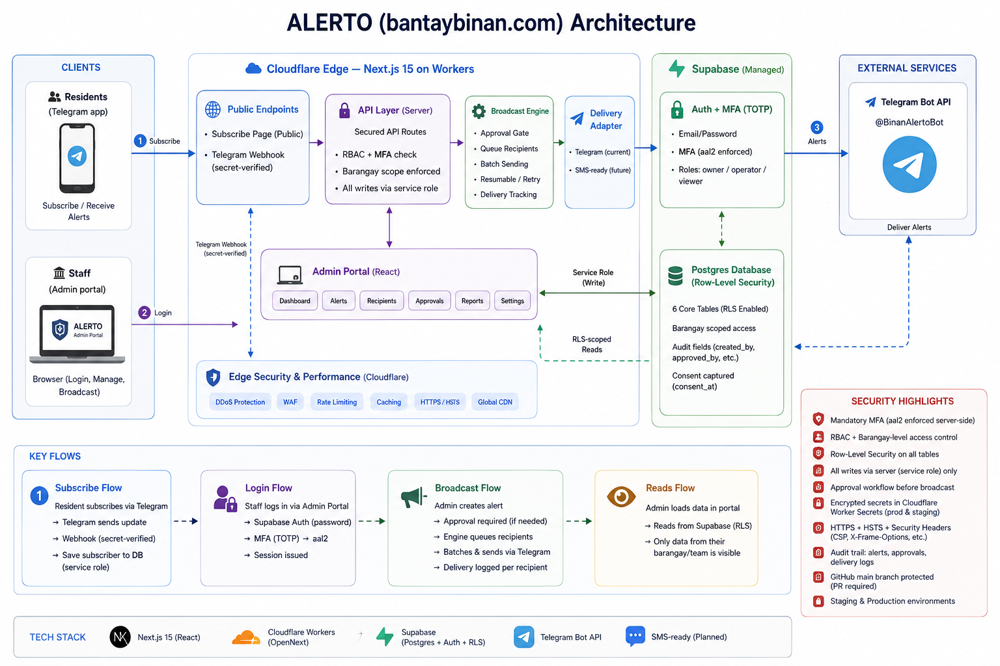

# Bantay Alerto — Architecture & Security

Bantay Alerto is the localized civic **alert-broadcast** app in this monorepo
(`apps/alerto`), live at **bantaybinan.com**. Residents subscribe on Telegram;
the Office of Councilor Titus "Bosseng" Bautista broadcasts alerts city-wide or
per-barangay. Everything runs on **Cloudflare + Supabase** — no origin server.

## Components

- **Clients** — Residents (Telegram app) · Staff (admin web portal)
- **Cloudflare Edge** — Next.js 15 on Workers (OpenNext):
  - Public subscribe page · Telegram webhook (secret-verified)
  - Admin portal (React) · secured API routes · resumable broadcast engine ·
    delivery adapter (Telegram now, SMS-ready)
- **Supabase** — Postgres (Row-Level Security) + Auth (staff, with MFA)
- **External** — Telegram Bot API (`@BinanAlertoBot`)

## Key flows

1. **Subscribe** — Resident → Telegram → webhook (secret-verified) → DB (service role)
2. **Login** — Staff → admin portal → Supabase Auth (password + MFA → session at `aal2`)
3. **Broadcast** — Admin → API (RBAC + MFA + barangay enforced) → create alert →
   **approval gate** → engine queues recipients → batched, resumable sends →
   Telegram → residents (per-recipient delivery tracked)
4. **Reads** — Admin browser reads Supabase directly, constrained by **RLS**
   (team member + barangay scope)

## Security

**Identity & access**
- Supabase Auth for staff; residents never have admin access
- **MFA (TOTP)** enforced server-side via the JWT `aal2` claim — not just UI
- **RBAC** (owner / operator / viewer), server-enforced
- **Per-barangay scoping** — staff see & send only their barangay (reads via RLS,
  sends via the API)
- **Approval workflow** — non-approvers submit; an owner/approver must approve
  before anything broadcasts

**Data**
- **Row-Level Security on all tables**; clients are read-only + scoped; no direct
  client writes
- All writes go through the server (service role) **after** an RBAC/MFA check
- Public anon key is RLS-guarded; service-role key is server-only
- Consent captured (`consent_at`) — Data Privacy Act

**Secrets** — service-role key, bot token, and webhook secret are encrypted
Cloudflare Worker Secrets (prod + staging); never `NEXT_PUBLIC`, never in client
code, never in git.

**Transport & perimeter** — HTTPS + HSTS; hardened headers (`X-Frame-Options`,
CSP `frame-ancestors`, `nosniff`, Referrer-Policy, Permissions-Policy); Cloudflare
DDoS protection with no exposed origin; Telegram webhook validates a shared secret
(401 on mismatch).

**Operations** — `main` is branch-protected (PR review required); separate staging
+ prod; full audit trail (per-recipient delivery logs + approval records +
`created_by` on every alert).

## Tech stack

| Layer | Choice |
| --- | --- |
| Frontend / Admin | Next.js 15 (App Router) + React + Tailwind |
| Edge runtime | Cloudflare Workers (via OpenNext) |
| Database | Supabase Postgres (Row-Level Security) |
| Auth (staff) | Supabase Auth + MFA (TOTP) |
| Delivery | Telegram Bot API (SMS-ready adapter) |
| Hosting | Cloudflare (custom domain `bantaybinan.com`) |
